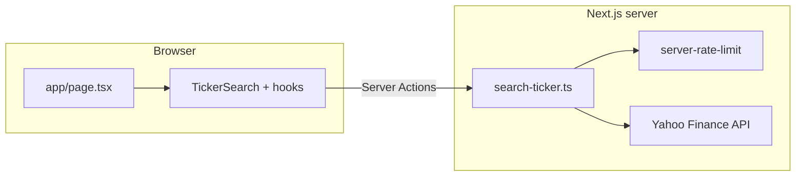

# Stock Analyzer

Next.js app to look up **stock tickers** and **company names** via [Yahoo Finance](https://finance.yahoo.com/) data—useful for validating symbols before backtesting or other workflows.

> **Disclaimer:** Market data comes from a third-party API. This app is not financial advice, not a trading platform, and may be rate-limited or unavailable if Yahoo’s services change.

---

## Features

- **Search by ticker or company name** — Server Actions resolve symbols; direct tickers use quotes, names use Yahoo search then quote.
- **Debounced autocomplete** — Suggestions list (combobox pattern) with keyboard navigation (arrows, Enter, Escape).
- **Inline validation** — Empty submit, max length (`100` characters, shared client/server), and accessible field hints (`aria-invalid`, `aria-describedby`, `role="status"` for length).
- **Result card** — Ticker + company name with fade-in; errors fade the card out when appropriate.
- **Dark mode** — Class-based theme with `localStorage`, inline script + `DocumentThemeSync` to avoid hydration flashes; header theme toggle.
- **Toasts** — Sonner for successful adds (errors use on-page alerts, not duplicate error toasts).
- **Observability (Vercel)** — `@vercel/analytics` and `@vercel/speed-insights` in the root layout (enable in the Vercel project dashboard after deploy).
- **Resilience** — Request timeouts (15s) on Yahoo calls, basic **per-IP rate limiting** on server actions (in-memory sliding window), structured `console.error` logging on server failures.

---

## Tech stack

| Area | Choice |
|------|--------|
| Framework | **Next.js 16.2.2** (App Router, Turbopack dev) |
| UI | **React 19.2.4**, **TypeScript 5** |
| Styling | **Tailwind CSS v4** (`@tailwindcss/postcss`), class-based `dark` variant |
| Compiler | **React Compiler** (`babel-plugin-react-compiler` in Next config) |
| Data | **yahoo-finance2** ^3.14 |
| Notifications | **Sonner** |
| Testing | **Vitest 4**, **Testing Library** (React, user-event, jest-dom), **jsdom** |
| Lint | **ESLint 9** + `eslint-config-next` |

---

## Architecture

The UI lives under `app/` and `components/`; shared logic is in `lib/` and `hooks/`. **Server Actions** in `app/actions/search-ticker.ts` call Yahoo; the browser never holds API secrets for Yahoo.



**Flow (simplified)**

1. User types → debounced `suggestTickers` for the dropdown.
2. Submit or pick a suggestion → `searchTicker` → quote (and search when input is not ticker-shaped).
3. Success updates the detail panel; failures set messages and optional leave animation on the previous card.

---

## Prerequisites

- **Node.js** 20+ (matches `@types/node` ^20; LTS recommended)
- **npm** (or pnpm/yarn/bun—commands below use `npm`)

---

## Getting started

Clone the repository and install dependencies from the **app root** (the directory that contains this `README.md` and `package.json`):

```bash
cd stockanalyzer
npm install
npm run dev
```

Open [http://localhost:3000](http://localhost:3000).

> If your clone has a **parent folder** that also contains a `package.json` (e.g. monorepo-style), run commands from **`stockanalyzer/`** so Next.js uses the correct `turbopack.root` and dependencies.

---

## npm scripts

| Script | Description |
|--------|-------------|
| `npm run dev` | Start Next.js dev server (Turbopack) |
| `npm run build` | Production build |
| `npm run start` | Start production server (after `build`) |
| `npm run lint` | Run ESLint |
| `npm run test` | Vitest in watch mode |
| `npm run test:run` | Vitest single run (CI-friendly) |

---

## Environment variables

**None are required** for local development. Yahoo access uses the `yahoo-finance2` library from the server only.

If you add secrets later (e.g. paid data providers), use `.env.local` and document them here; keep `.env*` out of git (already in `.gitignore`).

---

## Data & external APIs

- **Provider:** Yahoo Finance (via `yahoo-finance2`). Availability, quotas, and response shape can change without notice.
- **Limits (code):**
  - Query length: **`SEARCH_QUERY_MIN_LENGTH`** (2) to **`SEARCH_QUERY_MAX_LENGTH`** (100) in `lib/search-constraints.ts` (used by client and server).
  - **Rate limit:** ~**80 requests per minute per IP** (sliding window) for `searchTicker` / `suggestTickers`; `searchTicker` returns a user-visible error when exceeded; `suggestTickers` returns `{ success: false }`.
  - **Timeout:** **15 seconds** per Yahoo `quote` / `search` call; timeouts return a dedicated error message.

---

## Testing

Tests live under `tests/`:

- **`tests/actions/search-ticker.test.ts`** — Server action behavior (mocked Yahoo + `next/headers`).
- **`tests/components/TickerSearch.test.tsx`** — Search UI, debounce, validation, loading state (mocked actions + Sonner).

```bash
npm run test:run
```

---

## Accessibility & UX

- Search field uses a **combobox** pattern with **`role="listbox"`** / **`role="option"`**, **`aria-expanded`**, **`aria-activedescendant`**, and **`aria-controls`** when the list is visible.
- **Focus-visible** styles on buttons (and global baseline in `app/globals.css`).
- **Theme toggle:** `aria-pressed`, `aria-label`, decorative icons `aria-hidden`.
- **Length validation** uses **`role="status"`** + **`aria-live="polite"`**; submit errors use **`role="alert"`** on the result error line.

---

## Deployment (Vercel)

1. Connect the Git repo and set the **root directory** to **`stockanalyzer`** (if the repo contains a parent folder).
2. Build command: `npm run build`; output: Next.js default.
3. After deploy, open the Vercel project → **Analytics** / **Speed Insights** and enable if you want those dashboards (components are already in `app/layout.tsx`).

---

## Project structure

```
stockanalyzer/
├── app/
│   ├── actions/
│   │   └── search-ticker.ts      # Server Actions: searchTicker, suggestTickers
│   ├── globals.css
│   ├── layout.tsx                # Root layout, fonts, Analytics, Toaster, theme
│   └── page.tsx                  # Home: TickerSearch
├── components/
│   ├── ticker-search/            # Search subcomponents (card, list, alerts, detail window)
│   ├── DocumentThemeSync.tsx
│   ├── ThemeToggle.tsx
│   └── TickerSearch.tsx          # Composes hooks + form UI
├── hooks/
│   ├── useStockDetailPanel.ts    # Result card transitions + errors
│   └── useTickerSuggestions.ts   # Debounced suggestions fetch
├── lib/
│   ├── search-constraints.ts     # Shared min/max query length
│   ├── server-rate-limit.ts      # Per-IP sliding window
│   ├── theme.ts
│   ├── useDebouncedValue.ts
│   └── utils.ts
├── tests/
│   ├── actions/
│   ├── components/
│   ├── setup.ts
│   └── REGRESSION_SCENARIOS.md   # Manual regression notes
├── eslint.config.mjs
├── next.config.ts
├── package.json
├── postcss.config.mjs
├── tsconfig.json
└── vitest.config.ts
```

---

## Roadmap & known limitations

**Ideas for later**

- Historical prices / charts, watchlists, export to CSV.
- Stronger rate limiting (e.g. Redis/Upstash) for multi-instance deployments.
- i18n and broader market coverage messaging.

**Known limitations**

- In-memory rate limits **reset per server instance** (typical serverless caveat).
- Yahoo data quality and API stability are outside this project’s control.
- `tests/REGRESSION_SCENARIOS.md` is manual checklist-style documentation, not automated.

---

## License

No `LICENSE` file is included in this repository yet. Add one (e.g. MIT) if you intend to open-source or clarify terms.

---

## Assumptions (for readers & contributors)

- Commands are run from **`stockanalyzer/`** unless you’ve configured a workspace root that points here.
- Node **20+** is used; older majors are not validated in CI by this README alone.
